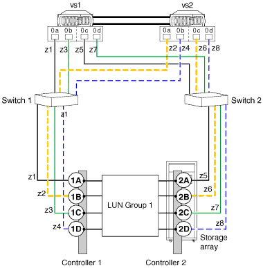

= Configuración de grupo LUN de cabina de ocho puertos
:allow-uri-read: 
:icons: font
:imagesdir: ../media/

[role="lead"]
Se admite una configuración de grupos LUN de ocho puertos en los sistemas V-Series en cluster y en los sistemas ONTAP que pueden usar LUN de cabina.

Esta configuración se admite para su uso con todas las cabinas de almacenamiento enumeradas en la matriz de interoperabilidad compatibles con la versión de ONTAP que se ejecuta en el sistema.

Hay dos formas de implementar esta configuración: Conexiones back-end cruzadas y no cruzadas.

== Conexiones de back-end cruzadas

En esta configuración con las conexiones de entorno de administración cruzadas, las conexiones FC de la misma controladora de la cabina de almacenamiento se dirigen a ambos switches estructurales (redundantes).

En esta ilustración de conexiones back-end cruzadas, tenga en cuenta cómo están conectados los nodos a los switches y a la cabina de almacenamiento. VS1 utiliza el switch 1 cuando se conecta a la cabina de almacenamiento El puerto 1A de Controller 1 y el puerto 2C de Controller 2, y utiliza el switch 2 cuando se conecta a la cabina de almacenamiento Los puertos 2A de Controller 2 y el puerto 1C de Controller 1. Esto optimiza el uso de puertos de switch y puertos de la cabina, lo que reduce el impacto de un fallo de un switch o una controladora de la cabina de almacenamiento.

image::../media/eight_port_array_lun_group_configuration_crossed.gif[se ha cruzado la configuración de un grupo lun de cabina de ocho puertos]

== Las conexiones de back-end no se cruzan

En esta configuración, en la que no se cruzan las conexiones de back-end, las conexiones FC de la misma controladora de la cabina de almacenamiento van a solo un switch estructural.

La siguiente ilustración muestra esta configuración cuando no se cruzan las conexiones del back-end.

*Información relacionada*

https://mysupport.netapp.com/matrix["Herramienta de matriz de interoperabilidad de NetApp"]

https://docs.netapp.com/us-en/ontap-metrocluster/install-fc/index.html["Instalación y configuración de MetroCluster estructural"]
