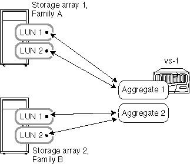

= Agregue reglas cuando las cabinas de almacenamiento sean de diferentes proveedores o familias
:allow-uri-read: 
:icons: font
:imagesdir: ../media/

[role="lead"]
Se aplican reglas específicas en la forma de distribuir LUN de cabina en agregados cuando las cabinas de almacenamiento son de diferentes proveedores o de diferentes familias de cabinas de almacenamiento del mismo proveedor.

Las siguientes reglas se aplican si sus cabinas de almacenamiento son de distintos proveedores o familias diferentes del mismo proveedor:

* No puede mezclar LUN de cabina de cabinas de almacenamiento de diferentes proveedores o de diferentes familias del mismo proveedor, en el mismo agregado.
* Es posible asociar el agregado que contiene el volumen raíz con cualquiera de las cabinas de almacenamiento, independientemente del tipo de familia de la cabina de almacenamiento.

[NOTE]
====
Al crear el agregado, asegúrese de especificar de forma explícita los ID de los LUN de cabina que desea añadir al agregado. No use los parámetros para especificar el número y el tamaño de LUN de cabina que se deben recoger, ya que el sistema puede recoger automáticamente LUN de una familia diferente o de una cabina de almacenamiento de otro proveedor. Después de que los LUN de cabina de distintas familias o proveedores se encuentren en el mismo agregado, la única forma de solucionar el problema de los LUN de cabina mixtos en un agregado es destruir el agregado y volver a crearlo.

====
Los siguientes ejemplos muestran opciones sobre cómo distribuir LUN de cabina en agregados cuando las cabinas son de _diferentes proveedores o de diferentes familias del mismo proveedor_.

== Ejemplo 1: Las LUN de las dos cabinas de almacenamiento se encuentran en agregados distintos

En este ejemplo, algunas LUN de ONTAP son de la cabina de almacenamiento 1, la familia A, mientras que las otras LUN de ONTAP son de la cabina de almacenamiento 2, familia B. No es posible añadir las LUN de las dos cabinas de almacenamiento al mismo agregado porque las dos cabinas de almacenamiento provienen de familias distintas del mismo proveedor. Lo mismo sucedería si las dos cabinas de almacenamiento fueran de proveedores diferentes.

== Ejemplo 2: Algunas LUN se pueden combinar en el mismo agregado y otras no

En este ejemplo, una cabina de almacenamiento es de la Familia A y las otras dos cabinas de almacenamiento son de la Familia B. Las LUN de la familia Una cabina de almacenamiento no puede añadirse al mismo agregado que las LUN de una cabina de almacenamiento de la familia B porque las cabinas de almacenamiento son de distintas familias. Sin embargo, el LUN 1 de la cabina de almacenamiento 3 se puede asignar al agregado 2, que también contiene LUN de la cabina de almacenamiento 2, dado que las dos cabinas de almacenamiento están en la misma familia.

image::../media/luns_assigned_to_multiple_aggrs_dif_and_same_family.gif[Este gráfico se describe con el texto circundante.]
