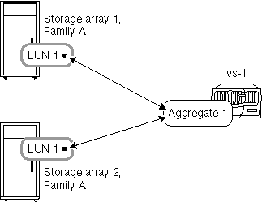

= Agregue reglas cuando las cabinas de almacenamiento son de la misma familia
:allow-uri-read: 
:icons: font
:imagesdir: ../media/

[role="lead"]
Se aplican reglas específicas a la forma de distribuir LUN de cabina en agregados cuando las cabinas de almacenamiento son del mismo proveedor de cabina de almacenamiento y de la misma familia de modelos.

Si las cabinas de almacenamiento son del mismo proveedor, las reglas para añadir LUN de cabinas a agregados son las siguientes:

* Puede mezclar LUN de cabina de las cabinas de almacenamiento en el mismo agregado si las cabinas de almacenamiento están en la misma familia.
* Es posible separar los LUN de cabina en diferentes agregados.

Los siguientes ejemplos muestran algunas opciones para distribuir LUN de cabina en agregados cuando las cabinas de almacenamiento tras un sistema ONTAP están en _la misma familia_ de proveedores.

[NOTE]
====
Para mayor simplicidad, las ilustraciones muestran solo dos cabinas de almacenamiento; su implementación puede incluir más cabinas de almacenamiento.

====

== Ejemplo 1: Añada LUN de todas las cabinas de almacenamiento a un único agregado

Como se muestra en la siguiente ilustración, puede crear un agregado y después añadir todas las LUN de todas las cabinas de almacenamiento de la misma familia al mismo agregado:

== Ejemplo 2: Distribuya y mezcle las LUN de las cabinas de almacenamiento en varios agregados

Tal y como se muestra en la siguiente ilustración, puede crear varios agregados y después distribuir y mezclar los LUN de cabina desde las diferentes cabinas de almacenamiento de la misma familia entre los agregados:

image:../media/luns_from_same_family_mixed_in_multiple_aggrs.gif[""]

[NOTE]
====
Este ejemplo no es compatible si tiene cabinas de almacenamiento del mismo modelo y una tiene unidades Fibre Channel y la otra cabina de almacenamiento tiene unidades SATA. En este caso, no se considera que esas cabinas de almacenamiento pertenezcan a la misma familia.

====