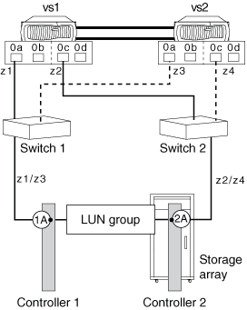

= Configuración de ejemplo: Puertos de destino compartidos
:allow-uri-read: 
:icons: font
:imagesdir: ../media/

[role="lead"]
Se puede conectar un máximo de dos puertos de iniciador FC de ONTAP a un único puerto de destino en la cabina de almacenamiento.

La práctica recomendada para la división en zonas es tener cada par de puertos iniciador-destino de FC en una zona separada (1:1).

== Puerto de destino compartido conectado a varios puertos de iniciador

En la siguiente ilustración, se muestran las conexiones y la división en zonas para compartir un puerto de destino con varios puertos de iniciadores de FC en diferentes sistemas de ONTAP.

Las líneas sólidas de la siguiente ilustración muestran las conexiones de los puertos de iniciador FC en el sistema VS1, y las líneas discontinuas muestran las conexiones de los puertos de iniciadores FC en el sistema VS2.

En la siguiente tabla se muestran las definiciones de zonas 1:1 para el ejemplo de un puerto de destino que comparte dos puertos de iniciador de FC de las controladoras en un par de alta disponibilidad:

|===
| Zona | Sistema ONTAP y puerto iniciador FC | Cabina de almacenamiento 

 a| 
*Interruptor 1*

 a| 
z1
| vs1:0a | Controlador 1: Puerto 1A 

 a| 
z3
| vs2:0a |  

 a| 
*Interruptor 2*

 a| 
z2
| vs1:0c | Controlador 2: Puerto 2A 

 a| 
z4
| vs2:0c |  
|===