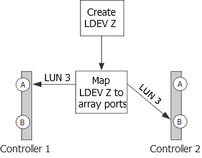

= Motivos de más grupos de LUN de cabina de lo esperado
:allow-uri-read: 
:icons: font
:imagesdir: ../media/

[role="lead"]
Al validar la configuración, debe comprobar `storage array config show` el resultado para asegurarse de que el número de grupos LUN sea lo que pretendía. La razón más común para grupos de LUN de matriz adicionales es que LDEV está extendiendo los pares de puertos de destino.

== Explicación

Los motivos por los que observaría más grupos de LUN de los esperados son los siguientes:

* Un LDEV no está asignado a un par de puertos de destino redundante.
+
La causa más común de un grupo de LUN adicional es que LDEV abarca pares de rutas. Se dice que un LDEV es _spanning path pairs_ si los ID de LUN coincidentes para LDEV no se presentan a un par de puertos de destino redundante en la cabina de almacenamiento.

[NOTE]
====
En muchas cabinas de almacenamiento, no es posible presentar un LDEV a puertos de destino que no son redundantes si se sigue el proceso convencional para crear y asignar LDEV.

====
* ONTAP intenta equilibrar la carga en los puertos de destino durante la migración de LUN de cabina de un grupo de LUN a otro.
+
En este caso, los pares de rutas de expansión LDEV son un estado de transición.

* Hay demasiadas conexiones configuradas.

ONTAP puede ejecutarse con un solo grupo de LUN de cabina o con varios grupos de LUN de cabina. Por lo tanto, ONTAP no considera que ningún número de grupos LUN sea una configuración incorrecta. Sin embargo, no son compatibles varios grupos de LUN para todas las cabinas de almacenamiento en todas las versiones de ONTAP. Durante la planificación de la configuración, debe comprobar la información en la matriz de interoperabilidad para verificar si hay varios grupos de LUN de cabinas compatibles con las cabinas de almacenamiento que se utilizan en la configuración de ONTAP.

== Situación de problema

Suponga que hay dos grupos de LUN existentes, el grupo LUN 0 y el grupo LUN 1. El grupo de LUN 0 tiene dos LUN de cabina y el grupo de LUN 1 tiene tres LUN de cabina. El administrador creó un nuevo LDEV Z, con la intención de agregar LUN 3 al grupo LUN 0. El administrador asignó LDEV Z como LUN 3 en dos puertos de la cabina de almacenamiento. Sin embargo, los puertos a los que se asigna el LUN 3, los puertos de la cabina de almacenamiento 1A y 2B, no son un par de puertos de destino redundante, como se muestra en la siguiente ilustración.

El resultado de este error es que se crea un tercer grupo de LUN no deseado (grupo 2), como se muestra en el siguiente ejemplo:

[listing]
----

mysystem1::> storage array config show

          LUN   LUN
Node      Group Count  Array Name  	Array Target Ports     	Switch Port  	Initiator
-------   ----- ------ ----------- 	-------------------    	-----------  	---------

mysystem1  0     3     DGC_RAID5_1  20:1A:00:a0:b8:0f:ee:04  vnbr20es25:5    0a
                                   	20:2A:00:a0:b8:0f:ee:04  vnci9124s53:6   0c
           1     3     DGC_RAID5_1  20:1B:00:a0:b8:0f:ee:04  vnbr20es25:7    0b
                                   	20:2B:00:a0:b8:0f:ee:04  vnci9124s53:8   0d
           2     1     DGC_RAID5_1  20:1A:00:a0:b8:0f:ee:04  vnbr20es25:5    0a
                                   	20:2B:00:a0:b8:0f:ee:04  vnci9124s53:8   0d
----
A partir de la información de la columna Puertos de destino de cabina para los grupos 0 y 1, puede inferir que las rutas a los puertos de destino de cabina son redundantes. El grupo 0 va a los puertos de destino 1A y 2A, un par de puertos de destino. El grupo 1 va a 1B y 2B, un par de puertos de destino diferente.

Sin embargo, la información de la columna Puertos de destino de cabina del Grupo 2 sugiere que las rutas no son redundantes. Una ruta va al puerto de destino 1A y la otra va al puerto de destino 2B. No se trata de un par de puertos de destino redundante; el LUN de la cabina abarca grupos de LUN. El LUN de cabina debería haberse asignado a 1A y 2A o a 1B y 2B.

Dado que el sistema ONTAP puede ejecutarse con pares de rutas de expansión LDEV, el mensaje que le indica que ejecute `storage errors show` no aparece después de ejecutar `storage array config show` el comando. Sin embargo, esta no es una configuración recomendada.

== Resolver el problema

. Espere un minuto y vuelva a ejecutar `storage array config show` para ver si el grupo de LUN adicional aún se muestra en `storage array config show` el resultado.
+
** Si el grupo LUN adicional ya no está en la salida, puede concluir que el problema era de transición.
** Si el grupo LUN adicional todavía aparece en el resultado, el administrador de la cabina de almacenamiento debe reasignar el LDEV, tal como se documenta en los siguientes pasos.
+
Debe mantener la redundancia al solucionar este problema. Este procedimiento le indica que asigne LDEV al puerto de destino correcto _before_ eliminando la asignación al puerto de destino incorrecto. En este caso, se mantiene la redundancia debido a que se aumenta la cantidad de rutas a tres, temporalmente, en lugar de reducir el número de rutas a una mientras se soluciona el problema.

. Decida cuáles de los puertos de destino incoherentes se deben volver a asignar.
. En la cabina de almacenamiento, asigne la LDEV al puerto de destino nuevo (correcto).
. En ONTAP, ejecute `storage array config show` para confirmar que se muestran tres rutas.
. Elimine la asignación incorrecta.
. Espere un minuto mientras ONTAP descubre la LUN.
. En ONTAP, corre `storage array config show` de nuevo para asegurarte de que el grupo de LUN extra ya no haya sido.

*Información relacionada*

https://mysupport.netapp.com/matrix["Herramienta de matriz de interoperabilidad de NetApp"]
